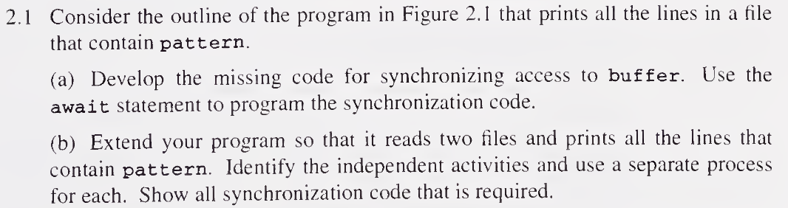
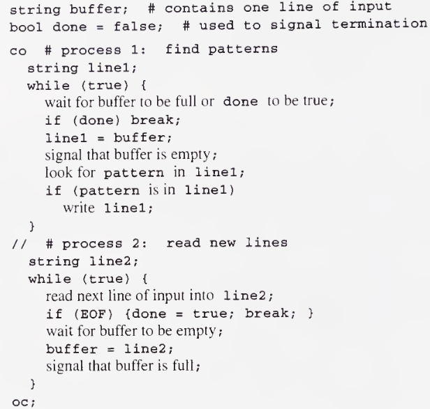
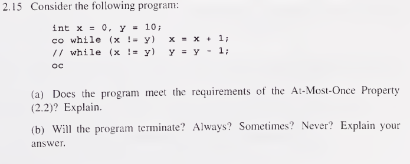
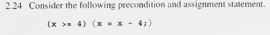
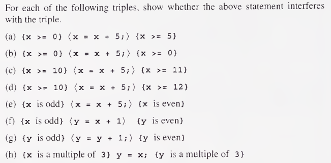

# Exercícios Cap. 2

Resolução dos exercícios: 1, 8, 13, 15, 18, 24, 33.

## 1



O programa em questão que a questão se refere é o seguinte:



### Letra a

Para desenvolvimento da sincronização é necessário:

```
string buffer;
bool done = false;
bool bufferFull = false;
co #process 1:
    string line1;
    while (true) {
        <await (bufferFull || done);>
        if (done) break;
        line1 = buffer;
        bufferFull = false;
        look for pattern in line 1;
        if (pattern is in line1)
            write line1;
    }
// # process 2:
    string line2;
    while(true) {
        read next line of input into line2;
        if (EOF) {done = true; brea;}
        <await (bufferFull == false);>
        buffer = line 2;
        bufferFull = true;
    }
oc;
```

### Letra b

```
string buffer;
bool doneProcessFile1 = false;
bool doneProcessFile2 = false;
bool bufferFull = false;
co #process 1:
    string line1;
    while (true) {
        <await (buffer || doneProcessFile1 || doneProcessFile2);>
        if (doneProcessFile1 || doneProcessFile2) break;
        line1 = buffer;
        bufferFull = false
        look for pattern in line1;
        if (pattern is in line1)
            write line1;
    }
// #process 2:
    string line2;
    while(true) {
        read next line of input into line2;
        if (EOF) {doneProcessFile1 = true; break;}
        <await (bufferFull == false);>
        buffer = line2;
        bufferFull = true
    }
// # process 3:
    string line3;
    while(true) {
        read next line of input into line3;
        if (EOF) {doneProcessFile2 = true; break;}
        <await (bufferFull == false);>
        buffer = line3;
        bufferFull = true;
    }
oc;
```

## 8
## 13

## 15



### Letra a
A propriedade de *At-Most-Once* não é respeitada dado que em ambos os processos fazem referência para uma variável que é alterada em outro.

### (b)

As vezes. A terminação depende da ordem em que ocorre a execução. Em situações onde a intercalação ocorra até que $x$ e $y$ foquem iguais então o programa irá terminar normalmente, contudo no caso de que um momento onde por emxemplo $x = 4$ e $y = 5$, $x$ poderá passar para $5$ e $y$ para $4$, assim $x > y$, dessa forma teremos então que o programa não vai terminar.

## 18

## 24




### (a)
- $a = \langle x = x-4; \rangle$
- $C = \{x \geq 0\}$
- $pre(a) = \{x \geq 4\}$
$$
	NI(a, C): \{(x \geq 0) \ \text{e} \ (x \geq 4)\} \ \langle x = x-4; \rangle \ \{x\geq 0\}  
$$
Fazendo a simplificação da pré-condição teremos:
$$
\{(x \geq 4)\} \ \langle x = x-4; \rangle \ \{x\geq 0\}
$$
$$
\{x - 4 \geq 4\} \ \langle x = x-4; \rangle \ \{x\geq 0\} \text{(axioma da atribuição)}
$$
Fazendo a simplificação teremos:
$$
\{x \geq 8\} \ \langle x = x-4; \rangle \ \{x\geq 0\}
$$
A partir da regra da consequência, para $\{x \geq 8\} \implies \{x \geq 4\}$
$$
\therefore \{(x \geq 4)\} \ \langle x = x-4; \rangle \ \{x\geq 0\} \ \text{c.q.d}
$$
- $a = \langle x = x-4; \rangle$
- $C = \{x \geq 5\}$
- $pre(a) = \{x \geq 4\}$
$$
	NI(a, C): \{(x \geq 5) \ \text{e} \ (x \geq 4)\} \ \langle x = x-4; \rangle \ \{x\geq 5\}  
$$
Fazendo a simplificação da pré-condição teremos:
$$
\{(x \geq 5)\} \ \langle x = x-4; \rangle \ \{x\geq 5\}
$$
$$
\begin{align*}
&\{x - 4 \geq 5\} \ \langle x = x-4; \rangle \ \{x\geq 5\} \text{(axioma da atribuição)} \\
&\{x \geq 9\} \ \langle x = x-4; \rangle \ \{x\geq 5\} \text{(simplificação)} \\
&\{x \geq 5\} \ \langle x = x-4; \rangle \ \{x\geq 5\} \text{(A partir da regra da consequência onde} \ \{x \geq 9 \implies x \geq 5\} \\
&\text{c.q.d}
\end{align*}
$$
Assim temos que não ocorre interferência!
### (b)
- $a = \langle x = x-4; \rangle$
- $C = \{x \geq 0\}$
- $pre(a) = \{x \geq 4\}$
$$
	NI(a, C): \{(x \geq 0) \ \text{e} \ (x \geq 4)\} \ \langle x = x-4; \rangle \ \{x\geq 0\}  
$$
Fazendo a simplificação da pré-condição teremos:
$$
\{(x \geq 4)\} \ \langle x = x-4; \rangle \ \{x\geq 0\}
$$
$$
\{x - 4 \geq 4\} \ \langle x = x-4; \rangle \ \{x\geq 0\} \text{(axioma da atribuição)}
$$
Fazendo a simplificação teremos:
$$
\{x \geq 8\} \ \langle x = x-4; \rangle \ \{x\geq 0\}
$$
A partir da regra da consequência, para $\{x \geq 8\} \implies \{x \geq 4\}$
$$
\therefore \{(x \geq 4)\} \ \langle x = x-4; \rangle \ \{x\geq 0\} \ \text{c.q.d}
$$

Segue a mesma prova anterior, logo não ocorre insterferência!

### (c)

- $a = \langle x = x-4; \rangle$
- $C = \{x \geq 10\}$
- $pre(a) = \{x \geq 4\}$

$$
	NI(a, C): \{(x \geq 10) \ \text{e} \ (x \geq 4)\} \ \langle x = x-4; \rangle \ \{x\geq 10\}  
$$

Fazendo a simplificação da pré-condição teremos:

$$
\begin{align*}
&\{x \geq 10\} \ \langle x = x-4; \rangle \ \{x\geq 10\} \\  
&\{x - 4 \geq 10\} \ \langle x = x-4; \rangle \ \{x\geq 10\} \text{(axioma da atribuição)} \\
&\{x \geq 14\} \ \langle x = x-4; \rangle \ \{x\geq 10\} \text{(simplificação)} \\
&\{x \geq 10\} \ \langle x = x-4; \rangle \ \{x\geq 10\} \text{(A partir da regra da consequência onde} \ \{x \geq 16 \implies x \geq 10\} \\
&\text{c.q.d}
\end{align*}
$$

- $a = \langle x = x-4; \rangle$
- $C = \{x \geq 11\}$
- $pre(a) = \{x \geq 4\}$

$$
	NI(a, C): \{(x \geq 11) \ \text{e} \ (x \geq 4)\} \ \langle x = x-4; \rangle \ \{x\geq 11\}  
$$

Fazendo a simplificação da pré-condição teremos:

$$
\begin{align*}
&\{x \geq 11\} \ \langle x = x-4; \rangle \ \{x\geq 11\} \\  
&\{x - 4 \geq 11\} \ \langle x = x-4; \rangle \ \{x\geq 11\} \text{(axioma da atribuição)} \\
&\{x \geq 15\} \ \langle x = x-4; \rangle \ \{x\geq 11\} \text{(simplificação)} \\
&\{x \geq 11\} \ \langle x = x-4; \rangle \ \{x\geq 11\} \text{(A partir da regra da consequência onde} \ \{x \geq 15 \implies x \geq 11\} \\
&\text{c.q.d}
\end{align*}
$$

Assim temos a não ocorrência de interferências.

### (d)

- $a = \langle x = x-4; \rangle$
- $C = \{x \geq 10\}$
- $pre(a) = \{x \geq 4\}$

$$
	NI(a, C): \{(x \geq 10) \ \text{e} \ (x \geq 4)\} \ \langle x = x-4; \rangle \ \{x\geq 10\}  
$$

Fazendo a simplificação da pré-condição teremos:

$$
\begin{align*}
&\{x \geq 10\} \ \langle x = x-4; \rangle \ \{x\geq 10\} \\  
&\{x - 4 \geq 10\} \ \langle x = x-4; \rangle \ \{x\geq 10\} \text{(axioma da atribuição)} \\
&\{x \geq 14\} \ \langle x = x-4; \rangle \ \{x\geq 10\} \text{(simplificação)} \\
&\{x \geq 10\} \ \langle x = x-4; \rangle \ \{x\geq 10\} \text{(A partir da regra da consequência onde} \ \{x \geq 16 \implies x \geq 10\} \\
&\text{c.q.d}
\end{align*}
$$

- $a = \langle x = x-4; \rangle$
- $C = \{x \geq 12\}$
- $pre(a) = \{x \geq 4\}$

$$
	NI(a, C): \{(x \geq 12) \ \text{e} \ (x \geq 4)\} \ \langle x = x-4; \rangle \ \{x\geq 12\}  
$$

Fazendo a simplificação da pré-condição teremos:

$$
\begin{align*}
&\{x \geq 12\} \ \langle x = x-4; \rangle \ \{x\geq 12\} \\  
&\{x - 4 \geq 12\} \ \langle x = x-4; \rangle \ \{x\geq 12\} \text{(axioma da atribuição)} \\
&\{x \geq 16\} \ \langle x = x-4; \rangle \ \{x\geq 12\} \text{(simplificação)} \\
&\{x \geq 12\} \ \langle x = x-4; \rangle \ \{x\geq 12\} \text{(A partir da regra da consequência onde} \ \{x \geq 16 \implies x \geq 12\} \\
&\text{c.q.d}
\end{align*}
$$

### (e)

- $a = \langle x = x-4; \rangle$
- $C = \{x \ \text{is odd}\}$
- $pre(a) = \{x \geq 4\}$

$$
	NI(a, C): \{(x \ \text{is odd}) \ \text{e} \ (x \geq 4)\} \ \langle x = x-4; \rangle \ \{x \ \text{is odd}\}  
$$

Fazendo a simplificação da pré-condição teremos:

$$
\begin{align*}
&\{(x \ \text{is odd}) \ \text{e} \ (x \geq 4)\} \ \langle x = x-4; \rangle \ \{x \ \text{is odd}\} \\
&\{(x - 4 \ \text{is odd}) \ \text{e} \ (x - 4 \geq 4)\} \ \langle x = x-4; \rangle \ \{x \ \text{is odd}\} \\
&\{(x \ \text{is odd}) \ \text{e} \ (x \geq 8)\} \ \langle x = x-4; \rangle \ \{x \ \text{is odd}\} \\
&\{(x \ \text{is odd}) \ \text{e} \ (x \geq 4)\} \ \langle x = x-4; \rangle \ \{x \ \text{is odd}\} \\
\end{align*}
$$

- $a = \langle x = x-4; \rangle$
- $C = \{x \ \text{is even}\}$
- $pre(a) = \{x \geq 4\}$

$$
	NI(a, C): \{(x \ \text{is even}) \ \text{e} \ (x \geq 4)\} \ \langle x = x-4; \rangle \ \{x \ \text{is even}\}  
$$

Teremos:

$$
\begin{align*}
&\{(x \ \text{is even}) \ \text{e} \ (x \geq 4)\} \ \langle x = x-4; \rangle \ \{x \ \text{is even}\} \\
&\{(x - 4 \ \text{is even}) \ \text{e} \ (x - 4 \geq 4)\} \ \langle x = x-4; \rangle \ \{x \ \text{is even}\} \\
&\{(x \ \text{is even}) \ \text{e} \ (x \geq 8)\} \ \langle x = x-4; \rangle \ \{x \ \text{is even}\} \\
&\{(x \ \text{is even}) \ \text{e} \ (x \geq 4)\} \ \langle x = x-4; \rangle \ \{x \ \text{is even}\} \\
\end{align*}
$$

Temos que não ocorre interferência.

### (f)

- $a = \langle x = x-4; \rangle$
- $C = \{x \ \text{is odd}\}$
- $pre(a) = \{x \geq 4\}$

$$
	NI(a, C): \{(x \ \text{is odd}) \ \text{e} \ (x \geq 4)\} \ \langle x = x-4; \rangle \ \{x \ \text{is odd}\}  
$$

Teremos:

$$
\begin{align*}
&\{(x \ \text{is odd}) \ \text{e} \ (x \geq 4)\} \ \langle x = x-4; \rangle \ \{x \ \text{is odd}\} \\
&\{(x - 4 \ \text{is odd}) \ \text{e} \ (x - 4 \geq 4)\} \ \langle x = x-4; \rangle \ \{x \ \text{is odd}\} \\
&\{(x \ \text{is odd}) \ \text{e} \ (x \geq 8)\} \ \langle x = x-4; \rangle \ \{x \ \text{is odd}\} \\
&\{(x \ \text{is odd}) \ \text{e} \ (x \geq 4)\} \ \langle x = x-4; \rangle \ \{x \ \text{is odd}\} \\
\end{align*}
$$

- $a = \langle x = x-4; \rangle$
- $C = \{y \ \text{is even}\}$
- $pre(a) = \{x \geq 4\}$

$$
	NI(a, C): \{(y \ \text{is even}) \ \text{e} \ (x \geq 4)\} \ \langle x = x-4; \rangle \ \{y \ \text{is even}\}  
$$

Teremos:

$$
\begin{align*}
&\{(y \ \text{is even}) \ \text{e} \ (x \geq 4)\} \ \langle x = x-4; \rangle \ \{y \ \text{is even}\} \\
&\{(y \ \text{is even}) \ \text{e} \ (x - 4 \geq 4)\} \ \langle x = x-4; \rangle \ \{y \ \text{is even}\} \\
&\{(y \ \text{is even}) \ \text{e} \ (x \geq 8)\} \ \langle x = x-4; \rangle \ \{y \ \text{is even}\} \\
&\{(y \ \text{is even}) \ \text{e} \ (x \geq 4)\} \ \langle x = x-4; \rangle \ \{y \ \text{is even}\} \\
\end{align*}
$$

### (g)

- $a = \langle x = x-4; \rangle$
- $C = \{y \ \text{is odd}\}$
- $pre(a) = \{x \geq 4\}$

$$
	NI(a, C): \{(y \ \text{is odd}) \ \text{e} \ (x \geq 4)\} \ \langle x = x-4; \rangle \ \{y \ \text{is odd}\}  
$$

Teremos:

$$
\begin{align*}
&\{(y \ \text{is odd}) \ \text{e} \ (x \geq 4)\} \ \langle x = x-4; \rangle \ \{y \ \text{is odd}\} \\
&\{(y \ \text{is odd}) \ \text{e} \ (x - 4 \geq 4)\} \ \langle x = x-4; \rangle \ \{y \ \text{is odd}\} \\
&\{(y \ \text{is odd}) \ \text{e} \ (x \geq 8)\} \ \langle x = x-4; \rangle \ \{y \ \text{is odd}\} \\
&\{(y \ \text{is odd}) \ \text{e} \ (x \geq 4)\} \ \langle x = x-4; \rangle \ \{y \ \text{is odd}\} \\
\end{align*}
$$

- $a = \langle x = x-4; \rangle$
- $C = \{y \ \text{is even}\}$
- $pre(a) = \{x \geq 4\}$

$$
	NI(a, C): \{(y \ \text{is even}) \ \text{e} \ (x \geq 4)\} \ \langle x = x-4; \rangle \ \{y \ \text{is even}\}  
$$

Teremos:

$$
\begin{align*}
&\{(y \ \text{is even}) \ \text{e} \ (x \geq 4)\} \ \langle x = x-4; \rangle \ \{y \ \text{is even}\} \\
&\{(y \ \text{is even}) \ \text{e} \ (x - 4 \geq 4)\} \ \langle x = x-4; \rangle \ \{y \ \text{is even}\} \\
&\{(y \ \text{is even}) \ \text{e} \ (x \geq 8)\} \ \langle x = x-4; \rangle \ \{y \ \text{is even}\} \\
&\{(y \ \text{is even}) \ \text{e} \ (x \geq 4)\} \ \langle x = x-4; \rangle \ \{y \ \text{is even}\} \\
\end{align*}
$$

Não temos interferência.

### (h)

- $a = \langle x = x-4; \rangle$
- $C = \{x \ \text{is a multiple of 3}\}$
- $pre(a) = \{x \geq 4\}$

$$
	NI(a, C): \{(x \ \text{is a multiple of 3}) \ \text{e} \ (x \geq 4)\} \ \langle x = x-4; \rangle \ \{x \ \text{is a multiple of 3}\}  
$$

Teremos:

$$
\begin{align*}
&\{(x \ \text{is a multiple of 3}) \ \text{e} \ (x \geq 4)\} \ \langle x = x-4; \rangle \ \{x \ \text{is a multiple of 3}\}   \\
&\{(x - 4 \ \text{is a multiple of 3}) \ \text{e} \ (x - 4 \geq 4)\} \ \langle x = x-4; \rangle \ \{x \ \text{is a multiple of 3}\} \\
&\{(x \ \text{is a multiple of 3}) \ \text{e} \ (x \geq 8)\} \ \langle x = x-4; \rangle \ \{x \ \text{is a multiple of 3}\} \\
&\{(x \ \text{is a multiple of 3}) \ \text{e} \ (x \geq 4)\} \ \langle x = x-4; \rangle \ \{x \ \text{is a multiple of 3}\} \\
\end{align*}
$$

Nesse caso não é verdade dado que se $x = 9$, temos que após isso $x$ não será um múltiplo de 3!

Logo teremos a interferência.

## 33